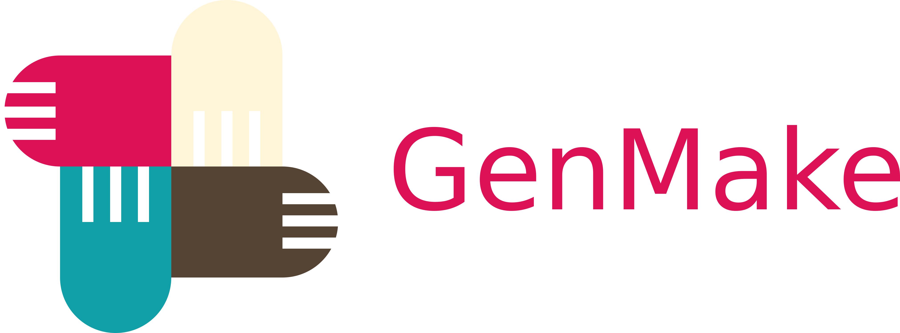

## Overview
A CMake-based project scaffolding tool.  
Click any of the following badges to see details.  
[](
http://skaff.readthedocs.io/en/latest/?badge=latest)
[](
http://opensource.org/licenses/BSD-2-Clause)
[](
https://semaphoreci.com/jhxie/skaff)

## Getting Started
To create a project directory named *nihil*:
```bash
skaff nihil
```
then a directory tree like the following will be created
(configuration files are not shown):  
  

Show usage help by:
```bash
skaff --help
```

For the detailed command-line reference manual, use *man* as usual:
```bash
man 1 skaff
```

A few more examples along with its detailed developers' documentation will be
given on [ReadTheDocs](http://skaff.readthedocs.io/en/latest/) later on.

## Versioning
Before version **v0.5** this project is in alpha stage, there may be serious
bugs.  
Beta stage starts at **v0.5** at which point all the necessary test cases would
be added.  
Once the version number gets to **v1.0** it goes out of beta stage and would
be released on [PyPI](https://pypi.python.org/pypi) as well; more features may
be added later on.

The changelog can be viewed [here](CHANGELOG.md).

## Installation
As mentioned in the above section, for now the only way to get the package is
here as well as the [BitBucket mirror](https://bitbucket.org/jhxie/skaff);
there is no *binary* (or *compiled-bytecode,* if you prefer) package available.

Once downloaded, make sure the version of python is **at least 3.3**:
```bash
python3 --version
```

And also remember to have **python3-setuptools** installed:

**Ubuntu** (14.04 and later)
```bash
sudo apt-get install python3-setuptools
```

**Fedora** (23 and later)
```bash
sudo dnf install python3-setuptools
```

Then simply change directory to where the un-compressed source directory
resides and install by:
```bash
sudo python3 ./setup.py install --optimize 1 --record install_log.txt
```

To run the bundled unit test suite:
```bash
python3 ./setup.py test
```

To uninstall the *skaff* program along with its data and manual page:
```bash
cat install_log.txt | sudo xargs rm -rf
sudo mandb
```

## Supported Platforms
* Linux
* FreeBSD
* Mac OS X (haven't tested, but I see no reason why it doesn't work)

## Credit
* [CMake](https://cmake.org) is developed and maintained by Kitware.
* The colorscheme of Skaff's logo is inspired by this
[example
](http://i34.photobucket.com/albums/d142/JanetB0601/ColorComboChallenge72.jpg).
* The **BSD-2-Clause** badge is from [here
](https://github.com/demhydraz/badge-collection).
* [Inkscape](https://inkscape.org/) is used to design the original SVG format
logo.
* Motivation from Douglas Mcilroy: "*As a programmer, it is your job to put
yourself out of business. What you do today can be automated tomorrow.*"

## License
Copyright &copy; 2016 Jiahui Xie  
Licensed under the [BSD 2-Clause License][BSD2].  
Distributed under the [BSD 2-Clause License][BSD2].

[BSD2]: https://opensource.org/licenses/BSD-2-Clause
