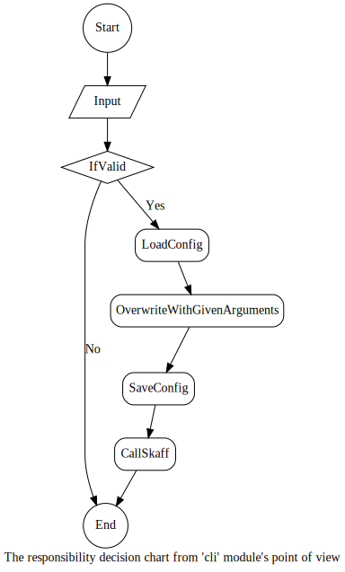

skaff package
===============

Submodules
----------

skaff.cli module
------------------

.. automodule:: skaff.cli
    :members:
    :undoc-members:
    :show-inheritance:

skaff.clitools module
-----------------------

.. automodule:: skaff.clitools
    :members:
    :undoc-members:
    :show-inheritance:

skaff.config module
---------------------

.. automodule:: skaff.config
    :members:
    :undoc-members:
    :show-inheritance:

skaff.driver module
-------------------

.. automodule:: skaff.driver
    :members:
    :undoc-members:
    :show-inheritance:

skaff.manualtools module
-------------------

.. automodule:: skaff.manualtools
    :members:
    :undoc-members:
    :show-inheritance:

Module contents
---------------

.. automodule:: skaff
    :members:
    :undoc-members:
    :show-inheritance:
